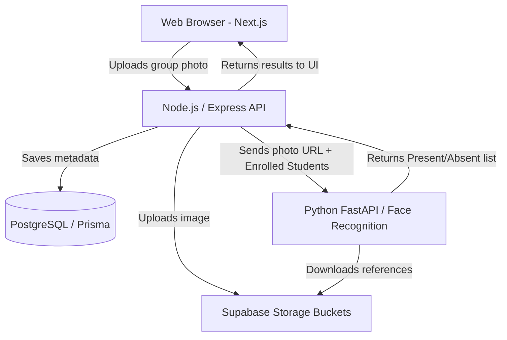

# Picture-Based Attendance System

> A smart, open-source attendance tracking system powered by facial recognition.

[](https://www.gnu.org/licenses/agpl-3.0)
[](http://makeapullrequest.com)

## 📌 Problem Statement

Traditional attendance systems—like roll calls, RFID cards, or sign-in sheets—are slow, prone to proxy attendance (buddy punching), and hard to manage at scale. Teachers and managers waste valuable time tracking who is present rather than focusing on the actual class or meeting.

## 💡 The Solution

**Picture-Based Attendance** automates the process using AI and facial recognition. By simply uploading a group photo of a classroom or meeting room, the system detects faces, matches them against a pre-enrolled database of individuals, and instantly marks attendance. It's fast, secure, and eliminates proxy attendance.

---

## ✨ Features

- **Automated Facial Recognition**: Upload a single group photo to mark attendance for everyone present.
- **High Accuracy & Fast Processing**: Powered by Python's `face_recognition` library and FastAPI.
- **Secure Biometric Handling**: Encodings are generated efficiently without storing raw PII data loosely.
- **Modern Web Dashboard**: A Next.js based frontend for teachers and admins to view and manage attendance.
- **Role-Based Access**: Manage classes, students, and generate attendance reports easily.
- **Developer-Friendly API**: Extensible Node.js/Express backend allowing easy integration into existing LMS.

---

## 🏗️ Tech Stack

- **Frontend**: Next.js (React), Tailwind CSS, Zustand
- **Backend API**: Node.js, Express, Prisma ORM, PostgreSQL
- **AI Service**: Python, FastAPI, `face_recognition`, OpenCV
- **Storage/Auth**: Supabase (PostgreSQL + Buckets)

---

## 📸 Screenshots

*(Replace with actual screenshots of the application)*

| Dashboard Overview | Face Recognition in Action |
| :---: | :---: |
|  |  |

---

## 📐 Architecture Diagram



---

## 📂 Folder Structure

```text
picture-based-attendance/
├── frontend/             # Next.js Web Dashboard
├── backend/              # Node.js/Express Server
├── ai-service/           # FastAPI Face Recognition Service
├── scripts/              # Useful scripts for local setup
├── .github/              # Issue/PR templates and workflows
├── CONTRIBUTING.md       # Guide for contributors
└── README.md             # This file
```

---

## 🚀 Installation & Setup

We have provided a unified script to install dependencies across all three services.

### Prerequisites
- Node.js (v18+)
- Python (v3.10+)
- PostgreSQL (or a Neon/Supabase DB URL)
- C/C++ Compiler (for `dlib` / `face_recognition` python bindings)

### Step 1: Clone the Repository
```bash
git clone https://github.com/YOUR-USERNAME/picture-based-attendance.git
cd picture-based-attendance
```

### Step 2: Environment Variables
Copy the `.env.example` file and configure it with your credentials:
```bash
cp .env.example .env
```

### Step 3: Install Dependencies
Run the setup script from the root of the project to install all required packages for frontend, backend, and ai-service:
```bash
./scripts/setup.sh
```

### Step 4: Run the Application
You can run each service in separate terminal windows:
- **Frontend**: `cd frontend && npm run dev`
- **Backend**: `cd backend && npm run dev`
- **AI Service**: `cd ai-service && uvicorn main:app --reload`

---

## 📖 Usage Instructions

1. **Enroll Students**: Go to the dashboard and upload 3 clear, front-facing photos for each student.
2. **Create a Session**: Create a new attendance session for a specific class or date.
3. **Upload Group Photo**: Take a clear picture of the classroom and upload it to the session.
4. **Process**: Click "Run Recognition" and wait for the AI to mark the attendance.
5. **Review & Save**: Manually adjust any false negatives (if someone was hiding) and save the attendance log.

---

## 🌱 Growth Hooks (For Contributors)

We are actively looking for contributors to help scale this project! Here are some ideas:

- **Modular Plugin System**: Build plugins to export attendance to Canvas LMS, Moodle, or Google Classroom.
- **Dashboard Improvements**: Add data visualization for attendance trends over the semester.
- **API Exposure**: Document and expose public API routes with API keys for developers to build third-party mobile apps.
- **Edge AI**: Help migrate the AI model to run inference closer to the edge for lower latency.
- **AI Deployment Optimization (High Impact)**:
  Deploying the FastAPI-based face recognition service efficiently and cost-effectively is a major challenge due to heavy dependencies like dlib and CPU-intensive inference.

  We are looking for contributors to:
  - Optimize model inference speed and memory usage
  - Reduce dependency footprint (lightweight alternatives to dlib)
  - Explore GPU vs CPU trade-offs for low-cost environments
  - Enable deployment on free/low-tier platforms (e.g., serverless, edge, or container-based solutions)
  - Implement batching or async processing for scalability

  If you have experience with ML optimization, Docker, or edge deployment, this is a high-impact area to contribute.

See the [CONTRIBUTING.md](./CONTRIBUTING.md) to get started!

---

## ⚖️ License (AGPLv3)

This project is licensed under the **GNU Affero General Public License v3 (AGPLv3)**.

**What does this mean in simple terms?**
You are free to use, modify, and distribute this software. However, if you modify the code and run it as a service over a network (e.g., providing this as a SaaS), you **must** make your modified source code available to your users under the same AGPLv3 license. 

This ensures that any enhancements to the attendance system remain open and beneficial to the community.

See the [LICENSE](./LICENSE) file for the full legal text.
